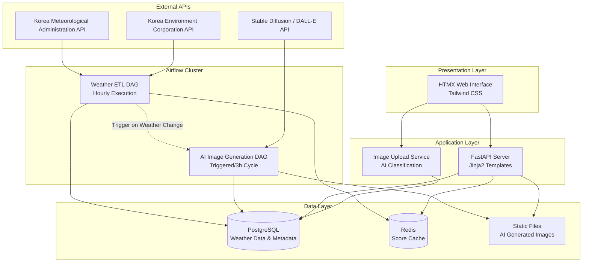

# Design Document

## Overview

인경호 뷰티 스코어 서비스는 Apache Airflow 기반의 데이터 파이프라인과 HTMX를 활용한 동적 웹 인터페이스를 결합한 현대적인 웹 애플리케이션입니다. 시스템은 "Heavy Backend, Light Frontend" 전략을 채택하여 복잡한 데이터 처리는 서버에서 담당하고, 클라이언트는 최소한의 JavaScript로 부드러운 사용자 경험을 제공합니다.

핵심 아키텍처는 세 개의 주요 레이어로 구성됩니다:
1. **데이터 파이프라인 레이어**: Airflow DAG를 통한 자동화된 데이터 수집 및 처리
2. **API 서비스 레이어**: FastAPI 기반의 RESTful 서비스와 서버 사이드 렌더링
3. **프레젠테이션 레이어**: HTMX와 Tailwind CSS를 활용한 반응형 웹 인터페이스

## Architecture

### System Architecture Diagram



### Data Flow Architecture

1. **Scheduled Data Collection**: Airflow Weather ETL DAG가 매시 정각에 외부 API에서 기상 데이터를 수집
2. **Real-time Score Calculation**: 수집된 데이터를 기반으로 뷰티 스코어를 계산하고 캐시에 저장
3. **Conditional Image Generation**: 날씨 변화 감지 시 AI Image DAG가 트리거되어 새로운 배경 이미지 생성
4. **Dynamic Content Serving**: HTMX를 통해 필요한 부분만 서버에서 HTML 조각으로 받아와 업데이트

## Components and Interfaces

### 1. Airflow Data Pipeline Components

#### Weather ETL DAG
- **FetchWeatherTask**: 기상청 API에서 현재 날씨 및 예보 데이터 수집
- **FetchAirQualityTask**: 환경공단 API에서 대기질 데이터 수집
- **CalculateScoreTask**: 수집된 데이터를 기반으로 뷰티 스코어 계산
- **UpdateDatabaseTask**: PostgreSQL과 Redis에 결과 저장
- **CheckWeatherChangeTask**: 이전 데이터와 비교하여 유의미한 변화 감지

#### AI Image Generation DAG
- **GeneratePromptTask**: 현재 날씨, 시간, 계절 정보를 기반으로 AI 프롬프트 생성
- **CallAIServiceTask**: Stable Diffusion 또는 DALL-E API 호출
- **SaveImageTask**: 생성된 이미지를 정적 파일 디렉토리에 저장
- **UpdateImageMetadataTask**: 이미지 메타데이터를 Redis에 캐시

#### Calendar Generation DAG
- **FetchForecastDataTask**: 기상청 중기예보 데이터 수집 (D+0 ~ D+10)
- **GenerateHistoricalPredictionTask**: 과거 3년 데이터 기반 통계 예측 (D+11 ~ 월말)
- **AssignSeasonalIconsTask**: 날짜별 계절 아이콘 할당
- **RenderCalendarHTMLTask**: 월간 캘린더를 HTMX 파셜 HTML로 렌더링
- **CacheCalendarDataTask**: 렌더링된 HTML과 데이터를 Redis에 저장

### 2. FastAPI Application Components

#### Core API Endpoints
```python
# Main page rendering
GET /                           # 메인 대시보드 페이지
GET /score                      # 현재 스코어 HTML 조각
GET /bg-image                   # 배경 이미지 업데이트 확인
GET /calendar/view              # 월간 캘린더 HTML 조각
GET /calendar/detail            # 특정 날짜 상세 정보

# Data API endpoints
GET /api/current-score          # JSON 형태의 현재 스코어
GET /api/hourly-forecast        # 시간별 예보 데이터
GET /api/monthly-calendar       # 월간 캘린더 데이터

# Upload endpoints
POST /upload/image              # 사용자 이미지 업로드
GET /upload/form                # 업로드 폼 HTML 조각
```

#### Template Rendering Service
- **Jinja2 템플릿 엔진**: 서버 사이드 렌더링을 위한 템플릿 처리
- **Partial HTML 생성**: HTMX 요청에 대한 HTML 조각 생성
- **Context 데이터 준비**: 템플릿에 필요한 데이터 준비 및 포맷팅

### 3. HTMX Web Interface Components

#### Dynamic UI Elements
```html
<!-- 실시간 스코어 업데이트 -->
<div hx-get="/score" hx-trigger="click" hx-target="#score-box">
    <button>🔄 새로고침</button>
</div>

<!-- 자동 배경 이미지 갱신 -->
<div hx-get="/bg-image" hx-trigger="every 60s" hx-swap="innerHTML">
    <!-- 배경 이미지 컨테이너 -->
</div>

<!-- 월간 캘린더 상세 보기 -->
<div hx-get="/calendar/detail" hx-trigger="click" hx-target="#modal">
    <!-- 캘린더 날짜 셀 -->
</div>
```

#### Responsive Layout Components
- **Hero Section**: AI 생성 배경 이미지와 현재 스코어 표시
- **Forecast Section**: 시간별 예보 그래프 및 최적 시간 하이라이트
- **Calendar Section**: 월간 뷰 및 상세 정보 모달
- **Upload Section**: 이미지 업로드 폼 및 진행 상태 표시

## Data Models

### PostgreSQL Schema

#### user_uploads Table
```sql
CREATE TABLE user_uploads (
    id SERIAL PRIMARY KEY,
    uploaded_at TIMESTAMP WITH TIME ZONE DEFAULT NOW(),
    file_path VARCHAR(255) NOT NULL,
    original_filename VARCHAR(255),
    exif_timestamp TIMESTAMP WITH TIME ZONE,
    ai_classification_result JSONB,
    is_approved BOOLEAN DEFAULT FALSE,
    beauty_score_at_time INTEGER,
    INDEX idx_uploaded_at (uploaded_at),
    INDEX idx_is_approved (is_approved)
);
```


### Redis Cache Schema

#### Score Cache
```
Key: "current_score"
Value: {
    "score": 85,
    "status_message": "인생샷 각",
    "weather_condition": "맑음",
    "updated_at": "2025-11-20T15:00:00Z"
}
TTL: 3600 seconds (1 hour)
```

#### Hourly Forecast Cache
```
Key: "hourly_forecast:2025-11-20"
Value: [
    {"hour": "09:00", "score": 75, "condition": "맑음"},
    {"hour": "10:00", "score": 80, "condition": "맑음"},
    ...
]
TTL: 3600 seconds (1 hour)
```

#### Calendar HTML Cache
```
Key: "calendar_html:2025-11"
Value: "<div class='calendar-grid'>...</div>"  # Pre-rendered HTMX partial
TTL: 86400 seconds (24 hours)

Key: "calendar_data:2025-11"
Value: {
    "2025-11-20": {"score": 85, "icon": "autumn_leaf"},
    "2025-11-21": {"score": 72, "icon": "duck"},
    ...
}
TTL: 86400 seconds (24 hours)
```

### Beauty Score Calculation (Airflow DAG Only)

Beauty score calculation is performed exclusively within Airflow DAGs to maintain separation of concerns and allow algorithm modifications without affecting the web service:

```python
# This calculation logic resides only in Airflow DAG tasks
def calculate_beauty_score_in_dag(weather_data: dict) -> int:
    """
    Beauty score calculation performed in Airflow DAG.
    FastAPI only serves pre-calculated results from Redis cache.
    """
    # Algorithm details are encapsulated in Airflow tasks
    # Results are stored in Redis for FastAPI consumption
    pass
```

**Key Architectural Decision**: 
- All score calculations happen in Airflow DAG tasks
- FastAPI serves only pre-calculated data from Redis cache
- This separation allows algorithm updates without web service deployment
## 
Correctness Properties

*A property is a characteristic or behavior that should hold true across all valid executions of a system-essentially, a formal statement about what the system should do. Properties serve as the bridge between human-readable specifications and machine-verifiable correctness guarantees.*

### Core System Properties

**Property 1: Score Range Validity**
*For any* cached beauty score data, the displayed score should always be an integer between 0 and 100 inclusive
**Validates: Requirements 1.1**

**Property 2: Status Message Mapping**
*For any* beauty score value, the system should display the correct status message according to score ranges
**Validates: Requirements 1.2**

**Property 3: Hourly Forecast Completeness**
*For any* current day, the short-term forecast should contain exactly 14 hourly entries from 09:00 to 22:00
**Validates: Requirements 2.1**

**Property 4: Best Time Highlighting**
*For any* hourly forecast data, exactly one time period with the highest score should be marked with a "Best" badge
**Validates: Requirements 2.2**

### Calendar and Seasonal Properties

**Property 5: Calendar Color Coding**
*For any* monthly calendar view, daily scores should be mapped to color intensities where higher scores produce more intense colors
**Validates: Requirements 3.1**

**Property 6: Seasonal Icon Display**
*For any* calendar date, appropriate seasonal icons (autumn leaves, cherry blossoms, ducks) should be displayed based on the date and historical patterns
**Validates: Requirements 3.4**

### Image Processing Properties

**Property 7: Image Classification Accuracy**
*For any* uploaded image, the AI classification system should correctly identify landscape/lake/nature content and reject inappropriate content (selfies, documents, food)
**Validates: Requirements 5.1, 5.2**

**Property 8: EXIF Metadata Extraction**
*For any* valid image file with EXIF data, the system should successfully extract and store the timestamp information
**Validates: Requirements 5.3**

### Data Serving Properties

**Property 9: Cache Data Freshness**
*For any* API request, the system should serve data from Redis cache and indicate data freshness appropriately
**Validates: Requirements 10.4**

**Property 10: Error Response Consistency**
*For any* system error condition, the API should return consistent error responses with appropriate HTTP status codes
**Validates: Requirements 7.1, 7.3, 7.4**

## Error Handling

### API Integration Error Handling

The system implements a multi-layered error handling strategy to ensure reliability:

1. **External API Failures**: When Korea Meteorological Administration or Environment Corporation APIs are unavailable, the system falls back to cached data in Redis with appropriate staleness indicators.

2. **AI Service Failures**: If Stable Diffusion or DALL-E APIs fail, the system continues using the most recent background image and schedules a retry.

3. **Database Connection Issues**: The application can operate in read-only mode using Redis cache when PostgreSQL is temporarily unavailable.

### Data Validation and Sanitization

1. **Weather Data Validation**: All incoming weather data is validated against expected ranges and formats before score calculation.

2. **Image Upload Validation**: Uploaded images undergo AI-based content classification to ensure appropriateness before storage.

3. **User Input Sanitization**: All user inputs are sanitized to prevent injection attacks and ensure data integrity.

### Graceful Degradation Strategies

1. **Partial Feature Availability**: If certain components fail, the system continues operating with reduced functionality rather than complete failure.

2. **Cache-First Architecture**: Critical data is always cached to ensure availability even during backend issues.

3. **Retry Mechanisms**: Failed operations are automatically retried with exponential backoff to handle transient failures.

## Testing Strategy

### Simplified Testing Approach

Given that the beauty score algorithm is still evolving, the testing strategy focuses on essential system behavior rather than specific algorithmic details:

**Unit Tests** verify core system functionality:
- API endpoint responses and status codes
- Template rendering with sample data
- Cache data retrieval and formatting
- Calendar generation and seasonal icon assignment
- Image upload and EXIF extraction
- AI image classification results
- Error handling for common failure scenarios

**Property-Based Tests** verify essential system properties:
- Data format consistency across API responses
- Calendar color coding and seasonal icon logic
- Image classification accuracy across diverse inputs
- EXIF metadata extraction reliability
- Error response structure and HTTP status codes
- Cache data freshness indicators

### Property-Based Testing Framework

The system uses **Hypothesis** (Python) for property-based testing with minimal configuration:
- Standard 100 iterations per property test
- Simple generators for API responses and cache data
- Focus on data structure validation rather than algorithmic correctness

### Test Annotation Requirements

Each property-based test must be tagged with:
- Format: `**Feature: ingyeongho-beauty-score, Property {number}: {property_text}**`
- Tests focus on system integration rather than algorithm validation
- Emphasis on API contract compliance and error handling

### Pragmatic Testing Philosophy

The testing approach prioritizes:
1. **System Reliability**: Ensure the web service remains stable regardless of algorithm changes
2. **API Contract Compliance**: Verify consistent response formats and error handling
3. **Integration Points**: Test external dependencies and fallback mechanisms
4. **Minimal Algorithm Testing**: Avoid testing specific score calculations that may change frequently